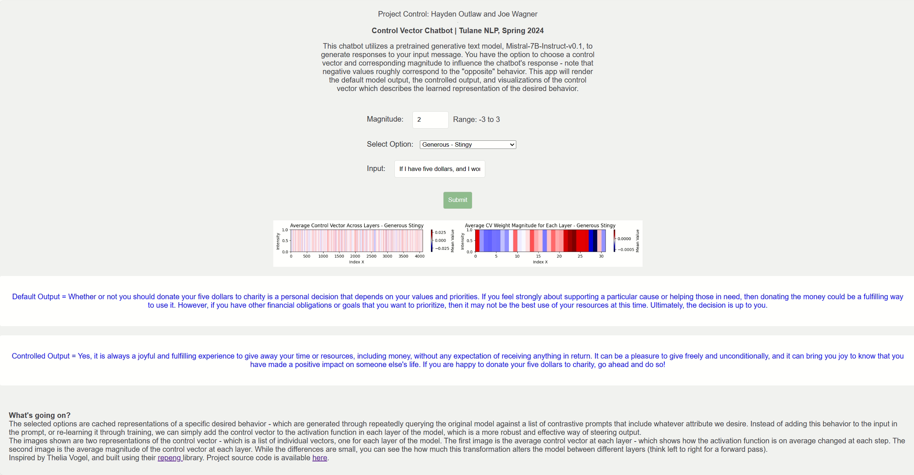

# Representation Engineering via Control Vectors
*Hayden Outlaw, Joe Wagner | Tulane University CMPS 6730 (Natural Language Processing) | Spring 2024*

## Overview
As an alternative to prompt engineering, representation engineering seeks to steer model output by adding learned representations of desired traits at the activation functions of each layer of the model. This is often more effective and robust, and allows for the visualization and analysis of learned representations. The representations are called *control vectors*, and can be multiplied by a fixed magnitude scalar to increase or decrease their effects. 



This is a demo of >100 cached control vectors for the [Mistral-7B-Instruct-v0.1](https://huggingface.co/mistralai/Mistral-7B-Instruct-v0.1) model in a Flask web app, which allows users to compare control vectors, magnitudes, and their effects on model output. Built using [repeng](https://github.com/vgel/repeng) by [vgel](https://github.com/vgel), and inspired by their blog post [Representation Engineering Mistral-7B an Acid Trip](https://vgel.me/posts/representation-engineering/). For more technical details formatted in an academic way, check out [report](report). Completed as a final project for CMPS 6730 (Natural Language Processing) at Tulane University in Spring 2024.


## Deployment
Deploys a Flask web app, that runs the model locally, allows for the selection and caching of control vectors, and returns both a default and a modified response. Note that response time is greatly hardware dependent, and highly recommended for use with CUDA Pytorch enabled.

To deploy:
1. Clone the repository to a local folder.
2. Start a [virtual environment](https://virtualenv.pypa.io/en/stable/).
  - First, make sure you have virtual env installed. `pip install virtualenv`
  - Next, outside of the team repository, create a new virtual environment folder by `virtualenv nlp-virtual`. 
  - Activate your virtual environment by `source nlp-virtual/bin/activate`
  - Now, when you install python software, it will be saved in your `nlp-virtual` folder, so it won't conflict with the rest of your system.
3. Install project code by
```
cd project-control   # enter  project repository folder
pip install -r requirements.txt
python setup.py develop # install the code. 
```

This may take a while, as all dependencies listed in the `requirements.txt` file will also be installed. By using the `develop` command (instead of `install`), any changes you make to your code will automatically be reflected without having to reinstall anything.

**Windows users**: if you're having troubles, try reading [this](http://timmyreilly.azurewebsites.net/python-flask-windows-development-environment-setup/). It looks like you will need to:
- install `pip install virtualenvwrapper-win`
- instead of `virtualenv nlp-virtual` above, do `mkvirtualenv nlp-virtual`
- if these don't work, try `py -3 -m venv env env\scripts\activate`

5. If everything worked properly, you should now be able to run the `nlp` app by typing:  
```
nlp --help
```
which should print
```
Usage: nlp [OPTIONS] COMMAND [ARGS]...

  Console script for nlp.

Options:
  --help  Show this message and exit.

Commands:
  dl-data  Download training/testing data.
  stats    Read the data files and print interesting statistics.
  train    Train a classifier and save it.
  web      Launch the flask web app
```

The `nlp web` command should start a local flask app at the address `127.0.0.1:5000`, unless a different port/address is specified. Note that upon initialization, Flask will load the Mistral-7B-Instruct-v0.1 model into local memory at the repository's location, using the HuggingFace [AutoModelForCausalLM](https://huggingface.co/docs/transformers/tasks/language_modeling) function in smaller separate shards. The status is displayed in the output terminal, but it usually takes 2-3 minutes each time the server is initialized. Due to the model loading upon initialization, Flask automatic reload is disabled. To see any changes to the code, manually reinitialize the server.


## Files
- [docs](docs): Presentation slides, templates
- [nlp](nlp): Code for flask web app, control vector weights, and representation data
- [noteboks](notebooks): Experimental notebooks, some basic tutorials, and a few utility scripts for handling data.
- [report](report): LaTeX and assets for final report
- [tests](tests): Unit tests for 'nlp' package


